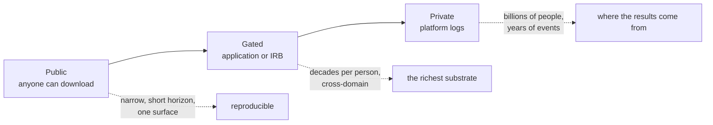

# Data and benchmarks

What the models in the [README](README.md) actually train and are measured on, with what is inside each one rather than just its name.

**Access is the field's binding constraint**, and the tiers below are ordered by it. The public tier is small and narrow. The richest longitudinal substrates sit behind applications. The largest corpora are platform logs no outsider can touch, which is why the frontier results are unreproducible. Scale figures are as reported in the cited papers.

## Public

### Behavioral logs: recommendation, clickstreams, media

| Dataset | Unit of behavior | Scale | Why it matters | Used by |
|---|---|---|---|---|
| **[Yambda-5B](https://arxiv.org/abs/2505.22238)** (Yandex Music) | music listens, likes, dislikes | 4.79B events · 1M users · 9.39M tracks · 11 months | largest open behavioral log ever released; ships audio embeddings and *explicit negative* feedback | scale-side of the missing-ImageNet argument |
| **[Tenrec](https://arxiv.org/abs/2210.10629)** (Tencent, NeurIPS 2022 D&B) | clicks, likes, shares, follows, **and true negatives** | ~5M users · ~140M interactions · **4 scenarios** | users and items **overlap between scenario pairs, partially and unevenly**, so you can sweep both panel size and overlap fraction; the best public cross-surface substrate | cross-domain transfer, multi-target CDR |
| **[ColdRec-1 / ColdRec-2](https://arxiv.org/abs/2001.04253)** (Tencent) | news and video watches | 50 or 100 source interactions/user; target users have ≤3 or ≤5 | **the same users appear on both sides** with ground-truth correspondence; source is QQ Browser, target is Kandian where everyone is cold-start | PeterRec, and the profile-probe protocol built on it |
| **[MicroLens](https://arxiv.org/abs/2309.15379)** (CIKM 2025) | short-video watches | 34M users · 1M videos · 1B interactions | ships **raw** titles, cover images, audio, and full video, not extracted features, so end-to-end modality training is possible | content-driven recommendation at scale |
| **[NineRec](https://arxiv.org/abs/2309.07705)** | multi-domain interactions with item text + images | 2M-user pretraining set · **9 downstream scenarios** | five same-platform and four **different-platform** targets: the within-wall vs across-wall split, made measurable | the transferable / ID-free line |
| **[PixelRec](https://arxiv.org/abs/2309.06789)** | image-item interactions | ~200M interactions · 30M users · 400K cover images | items modeled from **raw pixels**; benchmark spans 9 architectures × 9 image encoders | modality-transfer studies |
| **[OpenOneRec + RecIF-Bench](https://arxiv.org/abs/2512.24762)** (Kuaishou) | short-video, ads, product interactions | ~96M–100M interactions · 160K–200K users | released *with open model weights*; 8 tasks in a four-layer capability ladder from semantic alignment to reasoning | OpenOneRec |
| **[MovieLens 25M](https://grouplens.org/datasets/movielens/)** | movie ratings and interactions | 25M ratings | the default sequential-rec substrate; text metadata enables content modeling | SASRec/BERT4Rec lineage |
| **[Amazon Reviews 2023](https://amazon-reviews-2023.github.io/)** (McAuley lab) | product interactions with rich item text | dozens of categories | the standard cross-domain transfer testbed | UniSRec lineage, MiniOneRec |
| **[Douban (DGRec release)](https://arxiv.org/abs/1902.09362)** (Song et al., WSDM 2019) | movie, book and music ratings, **one account across all three** | 94,890 movie / 46,548 book / 39,742 music users · ~15.4M events · unix timestamps, 2005-2017 | **per-event timestamps and a single identity spanning three media domains**, unlike the ratings-only, no-time Douban files that circulate widely in cross-domain recommendation papers; 26,342 users are tri-domain | DGRec |
| **[Taobao UserBehavior / Tmall / Yoochoose / RetailRocket](https://tianchi.aliyun.com/dataset/649)** | e-commerce view, cart, purchase | varies | multi-event-type streams with real intent structure | sequential behavior modeling |
| **[Taobao-MM](https://huggingface.co/datasets/TaoBao-MM/Taobao-MM)** | e-commerce interaction sequences with precomputed multimodal item embeddings | 8.79M users · 35.4M items · 99M labeled samples | Apache-2.0 and same-day-downloadable at this scale is rare; per-event timestamp field not confirmed on the release page | multimodal sequential recommendation |
| **[TencentGR-1M / TencentGR-10M](https://huggingface.co/datasets/TAAC2025/TencentGR-1M)** (TAAC2025) | ads exposure/click/conversion sequences with multimodal item embeddings | 1M or 10M users (two tracks) · ~4.8M items | de-identified per-user sequences with timestamps, CC-BY-4.0, released April 2026 | TAAC2025 competition |
| **[RecSys Challenge 2025](https://recsys.synerise.com/summary)** (Synerise "Universal Behavioral Profiles") | buy, add-to-cart, remove-from-cart clickstream | 1M client_ids in the profiling task | real per-event `client_id` and timestamp from an online retailer; CC BY-NC 4.0, and whether the download persists past the challenge window is unconfirmed | RecSys Challenge 2025 entrants |
| **[Steam / Last.fm / Spotify MPD](https://www.aicrowd.com/challenges/spotify-million-playlist-dataset-challenge)** | plays and purchases over long horizons | varies | long per-user sequences with strong habit signal | habit and long-horizon modeling |
| **[Foursquare / Gowalla](https://sites.google.com/site/yangdingqi/home/foursquare-dataset)** | check-ins | varies | time-and-place mobility; highly habitual | next-location prediction |
| **[MIND](https://msnews.github.io/)** (Microsoft) | news click logs | ~1M users | the federated-recsys default | FedKD |
| **[Lichess database](https://database.lichess.org/)** | chess moves | billions of games, same player across years | finite move vocabulary, Elo ground truth, **persistent identified individuals**; behavioral stylometry proved identity is decodable from moves alone | Maia, behavioral stylometry |
| **[IRC Poker DB](https://poker.cs.ualberta.ca/irc_poker_database.html) / PHH** | betting sequences | ~10M hands (1995–2001) · 21.6M anonymized real-money hands | betting is fully observed style signal; multi-agent table dynamics | poker style modeling |
| **[Mind2Web / AgentNet / OS-Genesis](https://osu-nlp-group.github.io/Mind2Web/)** | screen-level computer use | varies | the richest modality; bridges user modeling and computer-use agents | GUM, computer-use agents |

### Elicited and experimental behavior

| Dataset | Unit of behavior | Scale | Why it matters | Used by |
|---|---|---|---|---|
| **[Psych-101](https://arxiv.org/abs/2410.20268)** | trial-by-trial experimental choices | ~10M choices · 60K+ participants · 160 experiments | the cognition-side pretraining corpus | Centaur, Small FMs of Human Cognition |
| **[SocSci210](https://huggingface.co/socratesft)** | social-science experiment responses | 2.9M responses · 400K participants · 210 experiments | ships **seen/unseen-study splits**, so generalization to a new experiment is measurable | Socrates |
| **[choices13k](https://github.com/jcpeterson/choices13k)** | risky-choice decisions | ~13K problems | the substrate for theory discovery from prediction | Peterson et al. (Science 2021) |
| **[Twin-2K-500](https://huggingface.co/datasets/LLM-Digital-Twin/Twin-2K-500)** | survey responses across four waves | 2,058 US participants · 500+ questions | **a held-out wave as per-person ground truth**, the right shape for digital-twin evaluation | digital-twin benchmarking |
| **[GSS](https://gss.norc.org/)** (NORC) | attitudes and reported behavior | since 1972; 2006–2014 panel waves reinterview the same people | test-retest normalization, so you can score a simulation against a person's own reliability ceiling | Generative Agent Simulations of 1,000 People |
| **[HUMANUAL](https://github.com/zou-group/humanlm)** | daily-life issues, political blogs, chat | 23K users · 227K responses | six public collections unified | HumanLM |
| **[Cognitive Genome](https://github.com/microsoft/AnthropomorphicIntelligence)** | Reddit/Twitter/Blogger/Amazon logs | 5.5M logs · 282K identified users → 1.27M QA pairs | public traces distilled into person-conditioned QA | HumanLLM |
| **[OdysSim corpus](https://arxiv.org/abs/2606.14199)** | aggregated behavioral records | 21.4M interactions · 10B tokens · 62 datasets | the pooled-corpus approach to the scarcity problem | OdysSim |
| **[ITC Database](https://www.nature.com/articles/s41597-026-06947-4)** (intertemporal-choice compilation) | intertemporal-choice trials and response times | 11,852 subjects · 1,172,644 trials · 100 studies | open, ongoing, growing by submission; subject-level records per study, cross-study linkage not confirmed | intertemporal-choice and cognitive modeling |

### Relational, transactional, and other

| Dataset | Unit of behavior | Scale | Why it matters | Used by |
|---|---|---|---|---|
| **[RelBench](https://relbench.stanford.edu/start)** | relational database events | 11 databases · ~66 temporal tasks | churn, LTV, purchase prediction from raw relational data, no feature engineering | Relational Deep Learning, KumoRFM |
| **[Multimodal Banking Dataset](https://arxiv.org/abs/2409.17587)** (Sber) | bank-client event sequences | large, multimodal | the only substantial public transaction benchmark | transaction-behavior models |

## Gated: application or IRB required

| Dataset | What is in it | Access | Used by |
|---|---|---|---|
| **UK Biobank** | long-horizon health timelines | application | Delphi-2M (forecasting 1,000+ diseases ~20 years out) |
| **Danish national registries** (Statistics Denmark) | health, education, job, income, address events at **day resolution for an entire population** | researcher application | life2vec (training), Delphi-2M (external validation on 1.9M Danes) |
| **Italian social-security records (INPS)** | administrative work and income trajectories | application | Life Sequence Transformer |
| **Epic Cosmos** | 118M patients · 115B medical events pooled across health systems | Epic community | CoMET |
| **Longitudinal panels** (PSID, NLSY79/97, HRS, Add Health, MIDUS, German SOEP, UK birth cohorts) | decades of income, health, family, attitudes for the same individuals | free with registration; **re-identification prohibited**, so trajectories yes, named personas no | panel-based trajectory work |
| **genagents interview tier** (Stanford) | 1,000 two-hour interviews + individual ground-truth responses | by application (demographic tier is public) | Generative Agent Simulations of 1,000 People |
| **Screenomics screen logs** | 20 users · one month · 1.9M screenshots → 360K captioned actions | IRB-restricted | LongNAP |
| **[OpenMHC](https://github.com/AshleyLab/OpenMHC)** (Open My Heart Counts) | wearable/mobile health-sensing traces, 60M+ sensor-hours, user ids and dates in benchmark tasks | Data Use Agreement, "qualified researchers" | wearable foundation model benchmarking |
| **[NetMob25](https://arxiv.org/abs/2506.05903)** | individual GPS trip trajectories with mode/purpose annotations, Greater Paris region; 3,337 participants, ~500M GPS points | terms of use plus an NDA (the paper itself is CC-BY-4.0) | mobility foundation model research |

**The pattern worth noticing**: the gated tier is where *cross-domain coverage of one person* lives. Health plus income plus employment plus family, for the same individual, over decades. No company has this, which is why the national-registry work is the field's actual ceiling on person-coverage.

## Private: platform logs

Not obtainable, but they define the frontier. Company, claimed scale, and the paper that reports it.

| Holder | Data | Reported scale / result | Papers |
|---|---|---|---|
| **Meta** | action streams across Family of Apps | HSTU at 1.5T params, +12.4% online; GEM on thousands of GPUs, +5% IG ad conversions, 20–25% MFU | HSTU, GEM, ExFM, LoopFM, Kunlun, LLaTTE |
| **Netflix** | tokenized member histories | production models scaled 2M → 1B params | Netflix FM, GenRec, Netflix scaling study |
| **Kuaishou** | short-video interaction streams | 400M+ DAU; Pro checkpoints trained on ~130B tokens **and released** | OneRec, OpenOneRec |
| **ByteDance / Douyin** | behavior sequences | up to 10K events per user, billion-user scale; 7B+7B item/user models | HLLM, Douyin system |
| **Alibaba / Taobao** | commerce behavior | power-law gains to 7B params; +2.9% CTR in sponsored search | LUM, RecGPT-V2 |
| **Ant Group / Alipay** | payments + behavior | billion-user; 84× memory reduction, 3.5× faster training via user tokenization | FOUNDv2/U2QT, Densing Law |
| **LinkedIn** | verbalized member activity | one 150B model serving 30+ ranking tasks | 360Brew |
| **Pinterest** | lifelong action streams | billion-scale user-sequence FM; ~2.5% sitewide | PinnerFormer, TransAct V2, OmniSage, PinFM |
| **Snap** | cross-surface engagement (Content, Ads, Growth, Lens) | 1+ year of history per user; six consuming surfaces | UUM |
| **Spotify** | listening histories | 80-dim embeddings at 6mo/1mo/1wk; +13% item-to-stream conversion | Generalized User Representations, GLIDE |
| **Yandex** | year-long histories incl. negative feedback | 3.2M → 1B params, gains at every step | ARGUS |
| **Tencent** | ads logs | billions of daily samples; +2.45% platform GMV | LFM4Ads, GPR |
| **Meituan** | local-commerce traffic | billion-user | MTGR |
| **Amazon / Airbnb** | shopping behavior; guest journeys | shared customer model; multi-week search-to-booking | MCM, JourneyFormer |
| **Visa** | consumer transactions + network signals | +22.5% over production model | TREASURE, TransactionGPT |
| **Stripe / Plaid / Mastercard / Nubank** | payments | Stripe on tens of billions of transactions; **Plaid across ~12,000 institutions** | industry writeups |
| **Sber** | transactions, online interactions, communications in one event stream | deployed at a major bank | CoLES, LATTE, Sber multimodal event FM |
| **Unbox AI** | anonymized retail events | ~10^8 unique actions, ~10^9 event tokens; ~600 scaling runs over 10^15–10^19 FLOPs | Scaling Laws for Behavioral FMs |
| **Simile** | grocery/delivery transactions + AI-led voice interviews | fine-tunes a Qwen3.5-27B simulation model | Building Confidence in Simile |

## Benchmarks

Where the field measures itself. Note the asymmetry: **CTR prediction has a standing, versioned, leaderboard-backed benchmark; person-representation quality and cross-domain transfer do not.**

**Ground truth** is added as its own column below because it is the fact a benchmark's headline number most often hides. A model scored against a **logged action** (a real click, purchase, or A/B outcome) is answering a different question than one scored against a **stated answer** (a survey or interview response), a **human rating**, an **LLM judge**'s opinion, or a **synthetic key** (a scripted verifier or researcher-authored answer with no real person behind it at all). All five appear below, often for benchmarks that read, from the name alone, as if they measure the same thing.

### Prediction and ranking

| Benchmark | What it scores | Ground truth | Notable |
|---|---|---|---|
| **[BARS / FuxiCTR](https://openbenchmark.github.io/BARS/)** | CTR prediction (AUC, LogLoss) | logged action (clicks) | public leaderboards and **pinned dataset IDs** so a result names its exact preprocessing; standard members are TaobaoAd (26M ad records, 1.14M users, ships demographic profile fields), KuaiVideo (3.24M interactions, 10K users), and Amazon Electronics in CTR framing (192K users, ~3M samples) |
| **[RecIF-Bench](https://arxiv.org/abs/2512.24762)** | 8 tasks across short video, ads, product | logged action | a four-layer capability ladder: semantic alignment → prediction → instruction following → reasoning |
| **[NineRec](https://arxiv.org/abs/2309.07705)** | cross-domain and cross-platform transfer | logged action | the closest thing to a standing transfer benchmark |
| **[RelBench](https://relbench.stanford.edu)** | 66 pinned temporal tasks on real relational logs (churn, lifetime value, purchase) | logged action | a maintained leaderboard over relational databases, not just flat interaction logs |
| **[RecBole](https://github.com/RUCAIBox/RecBole)** | Recall, NDCG, MRR at K on standard leave-one-out splits | logged action | SASRec and BERT4Rec ship built in, the default reproducibility harness for the sequential-rec lineage |
| **[RecFound](https://arxiv.org/abs/2506.11999)** | 13 tasks spanning generative and embedding-based recommendation | logged action | a broader task battery than any single dataset's own leaderboard |
| **[RecBase](https://arxiv.org/abs/2509.03131)** | zero-shot cross-domain recommendation accuracy | logged action | tests transfer without any fine-tuning on the target domain |
| **[AgentRecBench](https://huggingface.co/datasets/SGJQovo/AgentRecBench)** | agentic vs. classical recommender methods on a maintained comparison table | logged action | tracks whether LLM-agent recommenders actually beat the classical baselines they are compared against |
| **[RecAI / RecLM-eval](https://github.com/microsoft/RecAI)** | retrieval, ranking, explainability for LM-based recommenders | logged action | ships alongside **RecExplainer** (KDD 2024), which uses LLMs as surrogate models to interpret deep recommenders |

### Simulation and person fidelity

| Benchmark | What it scores | Ground truth | Headline finding |
|---|---|---|---|---|
| **[SimBench](https://arxiv.org/abs/2510.17516)** | group-level simulation, 20 datasets unified | stated answer | best LLMs score ~41/100; fidelity scales with model size but **not** with inference-time compute |
| **[BehaviorBench](https://arxiv.org/abs/2606.24162)** (Be.FM team) | behavior prediction, strategic decisions, trait inference | mixed: individual accuracy and population distributional alignment, reported separately | general LLMs win *individual* prediction; behavior-fine-tuned models win *distributional* alignment |
| **[BehaviorBench](https://arxiv.org/abs/2606.02798)** (Modeling Real-World User Decisions from Behavioral Traces) | user-decision prediction from behavioral traces | logged action | an unrelated paper sharing the same name as the row above, worth flagging since both surface under one search |
| **[Twin-2K-500](https://arxiv.org/pdf/2505.17479)** | digital twins against a held-out wave | stated answer (survey, held-out wave) | per-person ground truth rather than aggregate match |
| **[PersonaGym](https://arxiv.org/abs/2407.18416)** | persona-agent consistency | LLM judge | frontier models fail to stay in character, and **larger models are not reliably better** |
| **[TwinVoice](https://arxiv.org/pdf/2510.25536)** | imitation of specific individuals | mixed: matched against a real person's own text where the source supports it; persona and narrative dimensions read as LLM-judge or overlap-metric scored | decomposed into opinion consistency, memory recall, linguistic style |
| **[Mind the Sim2Real Gap](https://arxiv.org/abs/2603.11245)** (CMU, COLM 2026) | 451 humans vs 31 LLM user simulators | mixed: partly overlap with real human-annotated transcripts, partly survey agreement and task-success calibration | simulators are too cooperative and stylistically uniform; simulation runs in "easy mode," and higher general capability does not yield more faithful simulation |
| **[SOTOPIA](https://arxiv.org/abs/2310.11667)** (Sotopia-Hard) | social-goal completion and relationship/knowledge/secret-keeping dimensions in scripted two-party scenarios | LLM judge | the widely-used social-intelligence benchmark behind several downstream evaluations in this list |
| **[MirrorBench](https://arxiv.org/abs/2601.08118)** | how human-like a user-proxy agent is, across an extensible criteria set | LLM judge | one of several 2026 entrants scoring "human-likeness" directly rather than a downstream task |
| **[SimulatorArena](https://arxiv.org/abs/2510.05444)** | document-creation and math-tutoring multi-turn interactions, scored for realism as a simulator proxy | LLM judge | realism scored by a judge model, not by matching a real user's own transcript |
| **[BehaviorChain](https://arxiv.org/abs/2502.14642)** | persona-based behavior-chain simulation: whether a sequence of a character's decisions stays internally consistent | LLM judge | consistency, not correctness against a real person |
| **[LifeChoice](https://arxiv.org/abs/2404.12138)** ("Character is Destiny") | whether a role-playing agent makes persona-driven decisions consistent with a character's established traits | human rating | one of the few sim-fidelity benchmarks scored by people rather than a model |
| **[CoSER](https://arxiv.org/abs/2502.09082)** | coordinated LLM-based persona simulation of literary and dramatic roles | mixed: scored against the source text's actual dialogue for fictional characters, closer to a logged action for that narrow case | a rare instance where "the real answer" exists and is checkable, because the character's real lines are on the page |
| **[HUMANUAL](https://github.com/zou-group/humanlm)** (HumanLM benchmark suite) | user-response alignment and human-likeness across 6 datasets (chat, email, news, politics, book, opinion) | logged action (real recorded text from about 26,000 users, 216,000 responses) | one of the few simulation benchmarks whose answer key is real recorded human text, not a judge's opinion of it |
| **[HumanLLM](https://arxiv.org/abs/2601.15793)** (Cognitive Genome benchmark) | personalized understanding and simulation of human nature | LLM judge | built from real public traces, but scored generatively by a judge rather than against the traces themselves |
| **[AlignUSER](https://aclanthology.org/2026.acl-long.747)** | user-alignment across four public recommendation datasets, plus a real A/B correlation check | logged action, plus a real A/B correlation (r=0.71 against 55 real tests) | one of the strongest sim-to-real validations in the list: prompted frontier models score 8-22% next-action accuracy against 52.9% trained |
| **[ContextSim validation](https://arxiv.org/abs/2604.09549)** (Woven by Toyota) | correlation between simulator-predicted and measured real A/B test outcomes | logged action (55 real historical A/B tests) | real A/B ground truth is rare in this table; this and AlignUSER are the two entries that have it |
| **[Agent A/B](https://arxiv.org/abs/2504.09723)** | whether simulated persona agents reproduce the direction of a real UI A/B test's effect | logged action (a parallel real human A/B experiment) | direction-of-effect agreement with an actual experiment, not a judge's plausibility call |
| **[CitySim](https://arxiv.org/abs/2506.21805)** (person-level evaluation) | person-level prediction of real well-being survey responses inside an urban agent-based simulation | stated answer (1,200 real survey responses) | aggregate time-use matches national survey data, but individual-level prediction loses to a plain gradient-boosted baseline |
| **[Lost in Simulation](https://arxiv.org/abs/2601.17087)** (multi-country tau-bench study) | cross-country and cross-dialect variation in simulated-user task success and behavioral realism | human rating (real multi-country participants on tau-bench retail tasks) | realism gaps vary by country and dialect, not just by model |
| **[Simile confidence-model evaluation](https://www.simile.com/blog/confidence)** | decision-grade confidence calibration for population-level digital twins | mixed: population total-variation-distance metric plus agreement with 14 human raters (Fleiss kappa 0.75) | a linear probe on the simulation model's own hidden states predicts its error better than external methods |
| **[Validation is the central challenge](https://link.springer.com/article/10.1007/s10462-025-11412-6)** (AI Review 2026) | systematic review of 35 LLM-ABM papers | n/a (a review paper, not itself a scored suite) | most "validation" is face validity; comparison to empirical human data is the only scientific bar and the **rarest** strategy |

### Theory of mind and social reasoning

A different family: no real person is scored at all. The answer key is a researcher-authored scenario with one correct reading, useful for testing whether a model tracks beliefs and intentions, not whether it predicts what any actual person would do.

| Benchmark | What it scores | Ground truth | Notable |
|---|---|---|---|
| **[FANToM](https://arxiv.org/abs/2310.15421)** | machine theory-of-mind under conversational belief tracking and false-belief stress tests | synthetic key | designed adversarially against shortcut answers |
| **[Hi-ToM](https://arxiv.org/abs/2310.16755)** | higher-order (nested) theory-of-mind reasoning accuracy | synthetic key | tests belief-about-belief-about-belief, not first-order inference |
| **[ToMi / ParaphrasedToMi](https://arxiv.org/abs/2306.00924)** | theory-of-mind accuracy under paraphrased, harder-to-shortcut question wording | synthetic key | the paraphrase variant exists specifically because models were gaming the original's fixed wording |

## A taxonomy of behavioral data

| Axis | Range | Why it matters |
|---|---|---|
| **Consequence** | a click → a purchase → a job change | higher-stakes actions are scarcer but carry far more about the person |
| **Horizon** | one session → a year → a lifetime | separates transient intent from stable disposition |
| **Breadth** | one surface → one company → across companies | the union of environments bounds what of a person is observable |
| **Elicitation** | revealed (logs) → elicited (interviews, surveys) | revealed is honest but narrow; elicited is broad but stated-self |
| **Identity** | anonymous sessions → pseudonymous IDs → named individuals | determines whether transfer, evaluation, or personas are possible |

## Observations

- **The public tier is broad but shallow, the gated tier is deep but small, and the private tier is both and unreachable.** Every reproducibility problem in this field follows from that.
- **Cross-surface data on the same person barely exists publicly.** Tenrec and ColdRec are the exceptions, and both are cross-*surface within Tencent*, so the identity join is free and the cross-*company* case has no public substrate at all.
- **Elicited and revealed data almost never coexist for the same people.** Simile and the genagents interview tier are the closest, and both are proprietary or gated.
- **The one dataset carrying both behavior and demographics publicly is an ads dataset** (TaobaoAd), which is a small illustration of why advertising deserves more attention in this field than it gets.
- **Cross-media data on one identified person is rarer than cross-surface data within one company.** The Douban release above is the public counterexample (one account, movie/book/music, real timestamps), and it is easy to miss: several widely-used Douban files in cross-domain recommendation papers are ratings-only mirrors with no timestamps at all, a different release entirely.
- **Reading the Benchmarks tables by their new Ground truth column**: of the 34 listed there, 14 are scored wholly or partly against a real logged action (a click, purchase, or A/B outcome), 6 against an LLM judge's opinion, 3 against a survey or interview answer, 3 against a synthetic or researcher-authored key with no real person behind it, 2 against a human rating, and the rest mix these or don't apply. A benchmark's name rarely tells you which one it is; this list otherwise does not either, which is the gap this column is meant to close.
