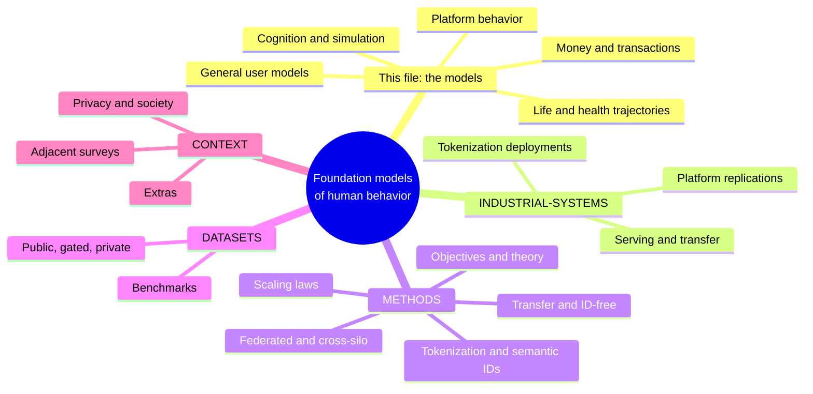

# Awesome Foundation Models of Human Behavior

If you are interested in this space reach out to me at jonathan@jeantechnologies.com!

A curated list for the emerging field of **foundation models of human behavior**: models pretrained on records of what people do (event logs, life trajectories, transactions, interactions) whose learned representations of people transfer across many tasks. The subject is the model *of* the person, not a model built *for* one task. The work is scattered across communities that rarely cite each other; this list is the shared shelf.

**Not in scope** (same words, different object): RL and robotics "behavior foundation models" (agent control policies), computer vision "human-centric foundation models" (body appearance and motion), brain foundation models such as TRIBE (neural responses to stimuli), and world models (environment dynamics). **In scope under other names**: Large Behavioral Models, Large User Models, foundation models of human cognition, general user models, digital twins of people, silicon sampling.

**This file is the models.** Everything that supports them lives in a companion file:

| File | What is in it |
|---|---|
| [MODELS: this file](README.md) | the models themselves, grouped by what kind of behavior they are trained on |
| [INDUSTRIAL-SYSTEMS.md](INDUSTRIAL-SYSTEMS.md) | every platform's own build of the generative-recommender recipe, the evidence for convergence |
| [METHODS.md](METHODS.md) | how these models get built: transfer, tokenization, scaling laws, federation, theory |
| [DATASETS.md](DATASETS.md) | the data and benchmarks they train and are measured on, as tables |
| [CONTEXT.md](CONTEXT.md) | adjacent-field surveys, privacy and society, prompted simulation, memory interfaces |

## Map

## Position & Vision

- [On the Opportunities and Risks of Foundation Models](https://arxiv.org/abs/2108.07258) · Stanford CRFM 2021. The root citation for "foundation model" (emergence + homogenization: one pretrained model, many tasks); §2.6 is the best philosophical treatment of whether a self-supervised model can be said to understand.
- [Large Behavioral Models: A Foundation Model Paradigm for Human Actions](https://research.unboxai.com/large-behavioral-models.html) · Unbox AI 2025. The position paper for the field: stated vs. revealed intent, "predicting what someone will do next requires understanding who they are," and the claim that behavioral data in retail+payments alone may exceed internet text by 100–1000x.
- [A Foundation Model for Consumption, Transactions & Actions](https://research.unboxai.com/foundation-model-for-consumption-transactions-and-actions.html) · Unbox AI 2025. One next-event-prediction engine applied to consumer/payments data; the consumption instantiation of the LBM series.
- [BehaviorGPT at Work: Workforce Actions & Dynamics](https://research.unboxai.com/behaviorgpt-foundation-model-workforce.html) · Unbox AI 2025. The same engine applied to workforce action streams, the cross-domain-series argument made concrete (see also [BehaviorGPT for Visual Art](https://research.unboxai.com/behaviorgpt-visual-art-and-aesthetics.html)).
- [Be.FM: Open Foundation Models for Human Behavior](https://arxiv.org/abs/2505.23058) · 2025. Open LLMs fine-tuned on diverse behavioral data to predict behaviors and infer individual/population characteristics; among the earliest explicit public uses of the term "foundation models for human behavior."

## The models

Grouped by the kind of behavioral record they are trained on. This is the core of the list.

### Platform behavior: recommendation, feeds, and ads

The pretrained person-models themselves. The systems that *serve*, *transfer*, or *apply* them, plus every platform's own replication of the recipe, are in [INDUSTRIAL-SYSTEMS.md](INDUSTRIAL-SYSTEMS.md).

- [Actions Speak Louder than Words (HSTU)](https://arxiv.org/abs/2402.17152) · Meta, ICML 2024. The founding document: ranking/retrieval reformulated as generative sequence transduction over user action streams, deployed at 1.5T parameters with +12.4% online gains ([code](https://github.com/meta-recsys/generative-recommenders)).
- [Meta's Generative Ads Model (GEM)](https://engineering.fb.com/2025/11/10/ml-applications/metas-generative-ads-model-gem-the-central-brain-accelerating-ads-recommendation-ai-innovation/) · Meta 2025. LLM-scale ads foundation model used as a teacher whose learnings are distilled across the entire ads model fleet; +5% ad conversions on Instagram.
- [Scaling User Modeling: Large-Scale Online User Representations for Ads Personalization in Meta](https://dl.acm.org/doi/10.1145/3589335.3648301) · Meta, WWW 2024 Companion. Meta's ads user-representation system, eighteen months before GEM; the entity-level user-embedding reference in the Meta lineage.
- [Universal User Modeling (UUM)](https://eng.snap.com/universal_user_modeling) · Snap 2026. A standalone foundational user model over 1+ year of behavior, trained with multi-task next-k event prediction, using per-domain sequence encoders plus information-bottleneck tokens to share across domains without negative transfer. Consumed by six surfaces including **both Ads and Content Search**, the deployed counterexample to running ads and organic as separate models.
- [Generalized User Representations for Large-Scale Recommendations](https://research.atspotify.com/2025/9/generalized-user-representations-for-large-scale-recommendations) · Spotify 2025. Two-stage framework: an autoencoder compresses multi-signal features into 80-dim user embeddings, downstream products adapt via transfer learning. Aggregates behavior at **~6 months / 1 month / 1 week** (core interests, mid-term shift, fresh intent), served batch plus near-real-time with an explicit consistency-management system for embedding drift.
- [Netflix's Foundation Model for Personalized Recommendation](https://netflixtechblog.medium.com/integrating-netflixs-foundation-model-into-personalization-applications-cf176b5860eb) · Netflix 2025. One autoregressive model over tokenized member interaction histories replaces a zoo of specialized models; consumed downstream via embeddings, subgraph reuse, and fine-tuning.
- [360Brew](https://arxiv.org/abs/2501.16450) · LinkedIn 2025. 150B decoder-only model that verbalizes member histories and serves 30+ ranking tasks with one model, generalizing zero-shot to new surfaces.
- [OneRec](https://arxiv.org/abs/2502.18965) · Kuaishou 2025. A single end-to-end generative model replaces the whole retrieval-ranking cascade at 400M+ DAU, tuned with preference alignment ([technical report](https://arxiv.org/abs/2506.13695); [OneRec-V2](https://arxiv.org/abs/2508.20900): lazy decoder plus RL from real user feedback).
- [OpenOneRec](https://arxiv.org/abs/2512.24762) · Kuaishou 2026. Open-weights OneRec-Foundation models (1.7B/8B, Qwen-based) plus the RecIF-Bench benchmark ([code](https://github.com/Kuaishou-OneRec/OpenOneRec)); the first major open behavioral-FM release from a platform.
- [PinnerFormer](https://arxiv.org/abs/2205.04507) · Pinterest, KDD 2022. The canonical user embedding from action sequences: a transformer trained with a dense all-action loss yields one reusable user representation serving many surfaces.

### Life trajectories, health, and long-horizon events

- [Using sequences of life-events to predict human lives (life2vec)](https://www.nature.com/articles/s43588-023-00573-5) · Nature Computational Science 2024. Danish registry records as a "language of life": one vocabulary of life-event tokens, one transformer, person embeddings that transfer to early mortality and personality prediction.
- [Life Sequence Transformer](https://arxiv.org/abs/2506.01874) · 2025. Moves life2vec from discriminative embedding to generative simulation on Italian social-security data, sampling counterfactual life paths that reproduce known labour-market patterns.
- [LifeSentence](https://arxiv.org/abs/2606.11220) · 2026. Tests whether language-model-style models encode life-course trajectories from longitudinal panel data rather than full national registries.
- [Delphi-2M](https://www.nature.com/articles/s41586-025-09529-3) · Nature 2025. A 2.2M-parameter GPT on UK Biobank health timelines forecasting 1,000+ diseases ~20 years out, with continuous time-to-event encoding; validated unchanged on 1.9M Danes.
- [ETHOS](https://www.nature.com/articles/s41746-024-01235-0) · npj Digital Medicine 2024. EHRs tokenized into Patient Health Timelines; a GPT trained on next-token prediction does zero-shot forecasting of future health events.
- [Generative Medical Event Models Improve with Scale (CoMET)](https://arxiv.org/abs/2508.12104) · Microsoft/Epic 2025. Decoder-only transformers pretrained on 118M patients / 115B medical events match or beat task-specific supervised models on 78 tasks with no fine-tuning.
- [Event Stream GPT](https://arxiv.org/abs/2306.11547) · NeurIPS D&B 2023. Open-source infrastructure defining the "event stream" data model: continuous-time, multi-attribute events with intra-event dependencies.
- [MoveGPT](https://arxiv.org/abs/2505.18670) · 2025. Mobility foundation model pretrained on multi-city trajectories, predicting next location and timestamp; companion [UniMove](https://arxiv.org/abs/2508.06986) unifies multi-city mobility prediction.
- [SASRec](https://arxiv.org/abs/1808.09781) · ICDM 2018. The lineage root: causal self-attention over a user's interaction sequence trained to predict the next item, the objective every later behavioral FM inherits.
- [BERT4Rec](https://arxiv.org/pdf/1904.06690) · CIKM 2019. The masked-event counterpart to SASRec, framing the enduring autoregressive-vs-masked objective tension.
- [TiSASRec](https://cseweb.ucsd.edu/~jmcauley/pdfs/wsdm20b.pdf) · WSDM 2020. Embeds actual time intervals between interactions into attention, early evidence that encoding continuous inter-event time improves behavioral prediction.
- [USER-LLM](https://arxiv.org/abs/2402.13598) · Google 2024. A self-supervised user encoder whose embeddings are injected into an LLM via cross-attention, outperforming and undercutting text-prompted raw histories.

### Money and transactions

- [TREASURE](https://arxiv.org/abs/2511.19693) · Visa 2025. Scalable universal transaction representation encoder jointly capturing consumer behavior and payment-network signals.
- [TransactionGPT](https://arxiv.org/abs/2511.08939) · Visa 2025. Transaction foundation model reporting +22.5% over the production model on a business metric.
- [CoLES](https://arxiv.org/abs/2002.08232) · Sber AI Lab, SIGMOD 2022. Canonical contrastive self-supervision for banking transaction streams, yielding reusable client embeddings deployed at industrial scale.
- [LATTE](https://arxiv.org/abs/2508.10021) · Sber AI Lab 2025. Contrastively aligns transaction-sequence embeddings with LLM-generated natural-language descriptions of client behavior.
- [A Foundation Model for Multimodal Event Sequences in Financial Applications](https://arxiv.org/abs/2607.09955) · Sber 2026. Production FM unifying transactions, online interactions, and communications into one chronological stream with a next-event objective; improved live business metrics at a major bank.
- [Open Banking Foundational Model](https://arxiv.org/abs/2511.12154) · 2025. Data-efficient behavioral representation learning from few transactions, evidence the paradigm degrades gracefully to sparse logs.
- [Foundation Models for Credit Risk Prediction](https://arxiv.org/abs/2605.18147) · 2026. Head-to-head of foundation models against tuned GBDTs on credit risk, a canonical person-level behavioral prediction task.

### Cognition, decisions, and simulated people

- [Social Simulacra](https://arxiv.org/abs/2208.04024) · Stanford/Google, UIST 2022. The paper before Generative Agents, same lead author: generate a *populated* prototype (posts, replies, antisocial behavior) from a designer's community spec, so failure modes that only appear at scale can be seen before launch. Behaviors shift appropriately when the design changes, and participants often cannot distinguish simulacra from real community behavior, the earliest simulated-population framing, and note it was a design instrument before it was a privacy workaround.

Trained models only. Prompted simulation and silicon sampling live in [Extras](#extras): the LLM's priors are the person-model there, and this list reserves the core sections for models with learned person-representations.

- [Centaur: A foundation model of human cognition](https://arxiv.org/abs/2410.20268) · Nature 2025. Llama-3.1-70B fine-tuned on Psych-101 (10M choices, 160 experiments) outpredicts classic cognitive models on held-out participants; representations align better with fMRI after fine-tuning.
- [Not Even Wrong: On the Limits of Prediction as Explanation](https://arxiv.org/abs/2510.03311) · 2025. The cognitive-architecture community's objection to Centaur: a unified model of behavior sans cognition cannot be falsified in a principled way.
- [Post-training makes LLMs less human-like (Psych-201)](https://arxiv.org/abs/2605.07632) · Binz et al. 2026. Post-training consistently reduces behavioral alignment across model families and objectives, and the misalignment widens in newer generations.
- [Flipping the Dialogue (UserLM-8b)](https://arxiv.org/abs/2510.06552) · Microsoft Research, ICLR 2026. Trains a user-side language model and finds better assistants are worse user simulators, assistant post-training optimizes away human-likeness ([weights](https://huggingface.co/microsoft/UserLM-8b)).
- [Finetuning LLMs for Human Behavior Prediction (Socrates / SocSci210)](https://arxiv.org/abs/2509.05830) · Stanford, EMNLP 2025. 2.9M individual responses from 210 social-science experiments; fine-tuned 14B models beat GPT-4o by 15% at predicting distributions of human responses.
- [OdysSim](https://arxiv.org/abs/2606.14199) · CMU 2026. An open 8B behavioral foundation model trained on 21.4M interactions from 62 behavioral datasets, first or tied-first on 8 of 23 benchmark tasks against frontier models.
- [HumanLM: State Alignment Beats Response Imitation](https://arxiv.org/abs/2603.03303) · Stanford 2026. Trains user simulators by RL-aligning a natural-language latent person-state with ground-truth responses; ships the HUMANUAL benchmark (23K users, 227K responses).
- [HumanLLM](https://arxiv.org/abs/2601.15793) · USTC/Microsoft, KDD 2026. Builds a 5.5M-log "Cognitive Genome" dataset from public traces of 282K users and SFTs small LLMs for personalized behavior prediction and simulation.
- [Can LLM Agents Simulate Multi-Turn Human Behavior?](https://arxiv.org/abs/2503.20749) · 2025. Against 230K+ real shopping actions, prompted frontier models fail at next-action prediction while a fine-tuned 7B model wins decisively, learned weights beat prompting on real logs.
- [AlignUSER: Human-Aligned LLM Agents via World Models for Recommender System Evaluation](https://aclanthology.org/2026.acl-long.747/) · Woven by Toyota, ACL 2026. Trained user simulator (world-model pretraining over page-state transitions plus counterfactual-reflection alignment, Qwen3-8B): prompted frontier models get 8-22% next-action accuracy on real shopping sessions vs 52.9% trained, and simulated engagement correlates r=0.71 with 55 real A/B tests, the strongest sim2real validation of simulation-as-evaluation to date. Part of the Woven by Toyota series (SimUSER, ContextSim, PerceptUI, CityReal).
- [Building Confidence in Simile](https://www.simile.com/blog/confidence) · Simile 2026. First research post from the commercial digital-twin lineage: the simulation model is a Qwen3.5-27B fine-tune on transactions + AI-led interviews, and a linear probe on its own hidden states predicts simulation error better than external methods.

### General-purpose user models

- [Creating General User Models from Computer Use (GUM)](https://arxiv.org/abs/2505.10831) · Stanford, UIST 2025. Ingests screenshots of any computer use and maintains confidence-weighted natural-language propositions about the user, the explicit-memory alternative to learned weights ([code](https://github.com/generalusermodels/gum)).
- [Learning Next Action Predictors from Human-Computer Interaction (LongNAP)](https://arxiv.org/abs/2603.05923) · Stanford 2026. Trains next-action predictors on a month of naturalistic screen logs per user; strong within-user gains but weak cross-user transfer at 10 users, the field's first direct data point on the difficulty of cross-user transfer on real logs.
- [PTUM: Pre-training User Model from Unlabeled User Behaviors](https://arxiv.org/abs/2010.01494) · EMNLP Findings 2020. One of the earliest explicit "pretrain the user model like a language model" statements: masked behavior and next-K behavior prediction, then fine-tune downstream.

## Companies & Ecosystem

Companies named in the source literature that train or ship models of people from behavioral data (no funding claims; see the papers above for what is actually published):

- [Jean Technologies](https://jeanmemory.com/) · develops foundation models of human behavior, and supports companies building their own.
- [Unbox AI](https://unboxai.com/) · one next-event-prediction engine (BehaviorGPT / Large Behavioral Models) applied across consumption, workforce, and aesthetics; publishes the field's most rigorous vendor scaling study.
- [Simile](https://www.simile.com/blog/confidence) · "agentic twins" of real consumers in the Park generative-agents lineage; trains a proprietary simulation model (Qwen3.5-27B fine-tune) on transactions plus AI-led interviews, with a published confidence model.
- [Markopolo AI (ATHENA)](https://markopolo.ai/newsroom/athena/) · 709M-parameter edge-deployed behavioral FM trained across 603 independent businesses, predicting next actions in clickstream sequences.
- [42ai](https://42ai.com/) · lab building a universal "Large Behavioral Model" for domains like capital markets and sales.
- [Constellation](https://constellationlab.io/) · foundation model of "human state" from neural, physiological, and behavioral signals, with its own collection panel.
- [Prior Computers](https://www.priorcomputers.ai/) · machine-psychology lab aiming at models that "learn and think like people."
- [Artificial Societies](https://societies.io/) · social-network simulation with interconnected personas; post-trains and distills models against distribution-accuracy targets.
- [Rehearsals](https://www.runrehearsals.com/) · digital twins of actual customers built on customers' own data.
- [Expected Parrot](https://www.expectedparrot.com/) · open-source simulation and validation tooling (EDSL) in the Horton lineage; fields the same instruments to real humans and simulated ones.
- [Kumo](https://kumo.ai/company/news/kumo-relational-foundation-model/) · relational foundation model answering "what will this customer do next?" over enterprise databases it has never seen.

## Related lists

- [awesome-fm-fl](https://github.com/lishenghui/awesome-fm-fl) · foundation models × federated learning (~200 papers).
- [LLM-UM-Reading](https://github.com/TamSiuhin/LLM-UM-Reading) · user modeling with large language models, the companion list to Tan & Jiang's survey.
- [Recommendation Systems without Explicit ID Features](https://github.com/westlake-repl/Recommendation-Systems-without-Explicit-ID-Features-A-Literature-Review) · the transferable/ID-free recommendation lineage.
- [Awesome-Human-Centric-Foundation-Models](https://github.com/HumanCentricModels/Awesome-Human-Centric-Foundation-Models) · the CV false friend, for disambiguation.

## Contributing

PRs welcome. Criteria: an entry must concern **modeling people from behavioral data**, models trained on records of human behavior whose person-representations transfer across tasks, or be a load-bearing adjacent result (theory, evaluation, privacy, or a false friend worth disambiguating). One line per entry: title, link, venue/org, year, one factual sentence. No marketing language. Core sections require a trained model over behavioral data; prompted-LLM simulation, infrastructure, and secondhand sources belong in Extras.

## License

[CC0 1.0 Universal](https://creativecommons.org/publicdomain/zero/1.0/), to the extent possible under law, the contributors have waived all copyright and related rights to this work.
