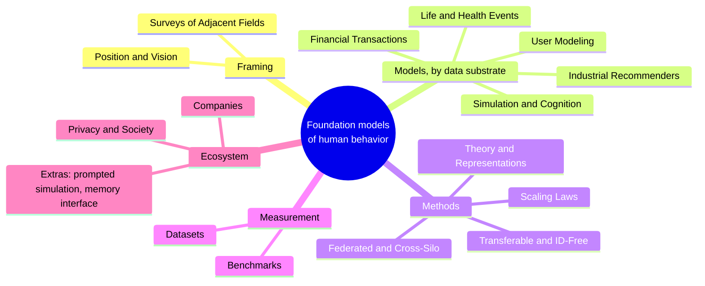

# Awesome Foundation Models of Human Behavior

If you are interested in this space reach out to me at jonathan@jeantechnologies.com!

A curated list for the emerging field of **foundation models of human behavior**: models pretrained on records of what people do (event logs, life trajectories, transactions, interactions) whose learned representations of people transfer across many tasks. The subject is the model *of* the person, not a model built *for* one task. The work is scattered across communities that rarely cite each other; this list is the shared shelf.

**Not in scope** (same words, different object): RL and robotics "behavior foundation models" (agent control policies), computer vision "human-centric foundation models" (body appearance and motion), brain foundation models such as TRIBE (neural responses to stimuli), and world models (environment dynamics). **In scope under other names**: Large Behavioral Models, Large User Models, foundation models of human cognition, general user models, digital twins of people, silicon sampling.

## Map

## Contents

**Framing**: [Position & Vision](#position--vision) · [Surveys of Adjacent Fields](#surveys-of-adjacent-fields)

**Models**: [Industrial Behavioral FMs & Generative Recommenders](#industrial-behavioral-foundation-models--generative-recommenders) · [Life Trajectories & Event Sequences](#life-trajectories--event-sequences) · [Financial & Transaction Behavior](#financial--transaction-behavior) · [Human Simulation & Cognition](#human-simulation--cognition) · [User Modeling & Personalization](#user-modeling--personalization)

**Methods**: [Transferable & ID-Free Recommendation](#transferable--id-free-recommendation) · [Scaling Laws for Behavior](#scaling-laws-for-behavior) · [Federated & Cross-Silo](#federated--cross-silo) · [Objectives, Representations & Theory](#objectives-representations--theory)

**Measurement**: [Evaluation & Benchmarks](#evaluation--benchmarks) · [Datasets](DATASETS.md)

**Ecosystem**: [Privacy, Manipulation & Society](#privacy-manipulation--society) · [Companies & Ecosystem](#companies--ecosystem) · [Extras](#extras) · [Related lists](#related-lists) · [Contributing](#contributing) · [License](#license)

## Position & Vision

- [On the Opportunities and Risks of Foundation Models](https://arxiv.org/abs/2108.07258) · Stanford CRFM 2021. The root citation for "foundation model" (emergence + homogenization: one pretrained model, many tasks); §2.6 is the best philosophical treatment of whether a self-supervised model can be said to understand.
- [Large Behavioral Models: A Foundation Model Paradigm for Human Actions](https://research.unboxai.com/large-behavioral-models.html) · Unbox AI 2025. The position paper for the field: stated vs. revealed intent, "predicting what someone will do next requires understanding who they are," and the claim that behavioral data in retail+payments alone may exceed internet text by 100–1000x.
- [A Foundation Model for Consumption, Transactions & Actions](https://research.unboxai.com/foundation-model-for-consumption-transactions-and-actions.html) · Unbox AI 2025. One next-event-prediction engine applied to consumer/payments data; the consumption instantiation of the LBM series.
- [BehaviorGPT at Work: Workforce Actions & Dynamics](https://research.unboxai.com/behaviorgpt-foundation-model-workforce.html) · Unbox AI 2025. The same engine applied to workforce action streams, the cross-domain-series argument made concrete (see also [BehaviorGPT for Visual Art](https://research.unboxai.com/behaviorgpt-visual-art-and-aesthetics.html)).
- [Be.FM: Open Foundation Models for Human Behavior](https://arxiv.org/abs/2505.23058) · 2025. Open LLMs fine-tuned on diverse behavioral data to predict behaviors and infer individual/population characteristics; among the earliest explicit public uses of the term "foundation models for human behavior."

## Surveys of Adjacent Fields

- [Foundation Models for Recommender Systems: A Survey and New Perspectives](https://arxiv.org/abs/2402.11143) · 2024. The declared foil: FMs *for* recommendation, organized by the feature-based → generative → agentic arc; expanded 2025 successor [here](https://arxiv.org/abs/2504.16420).
- [Recommendation with Generative Models](https://arxiv.org/abs/2409.15173) · Deldjoo, He, McAuley et al. 2024. Book-length consolidation of generative recommendation, organized by backbone modality (ID-driven / LLM-based / multimodal), with dedicated risk and evaluation treatment.
- The 2023 LLM4Rec survey wave: [Liu et al.](https://arxiv.org/abs/2302.03735) (pretrain/prompt strategies), [Wu et al.](https://arxiv.org/abs/2305.19860) (discriminative vs. generative), [Lin et al.](https://arxiv.org/abs/2306.05817) (where × how to adapt in the pipeline), [Fan et al.](https://arxiv.org/abs/2307.02046) (pretrain/fine-tune/prompt), [Li et al.](https://arxiv.org/abs/2309.01157) (single-stage generative recommendation). All FMs-for-the-task; none takes the person-model as its object.
- [A Survey on User Behavior Modeling in Recommender Systems](https://arxiv.org/abs/2302.11087) · IJCAI 2023. The incumbent field's self-description ("UBM"): conventional / long-sequence / multi-type / side-info behavior modeling, with industrial practice notes.
- [Multimodal Pretraining, Adaptation, and Generation for Recommendation](https://arxiv.org/abs/2404.00621) · KDD 2024. Lifecycle-stage cut over content modalities, the record of recommendation escaping ID-locked vocabularies from the content side.
- [User Simulation in the Era of Generative AI](https://arxiv.org/abs/2501.04410) · Balog & Zhai 2025. The conceptual map of user simulation's three roles: user modeling, synthetic training data, and evaluation instrument.
- [User Modeling in the Era of Large Language Models](https://arxiv.org/abs/2312.11518) · Tan & Jiang 2023. The bidirectional framing (LLMs for user modeling / user modeling for LLMs); the closest thing the assistant thread has to a dedicated survey.
- [Advances in Temporal Point Processes: Bayesian, Neural, and LLM Approaches](https://arxiv.org/abs/2501.14291) · 2025. The principled framework for modeling *when* the next event happens, complementary to the transformer's *what*.
- [A Survey of Context Engineering for LLMs](https://arxiv.org/abs/2507.13334) · 2025. The discipline-founding survey of the interface layer through which person-context reaches a model.
- [Memory in the Age of AI Agents](https://arxiv.org/abs/2512.13564) · 2025. Taxonomy of memory forms (token-level / parametric / latent), the three competing answers to "where does the representation of the person live."
- [From Persona to Personalization: Role-Playing Language Agents](https://arxiv.org/abs/2404.18231) · 2024. Covers the persona-construction and role-play corner of person simulation.

## Industrial Behavioral Foundation Models & Generative Recommenders

- [Actions Speak Louder than Words (HSTU)](https://arxiv.org/abs/2402.17152) · Meta, ICML 2024. The founding document: ranking/retrieval reformulated as generative sequence transduction over user action streams, deployed at 1.5T parameters with +12.4% online gains ([code](https://github.com/meta-recsys/generative-recommenders)).
- [Meta's Generative Ads Model (GEM)](https://engineering.fb.com/2025/11/10/ml-applications/metas-generative-ads-model-gem-the-central-brain-accelerating-ads-recommendation-ai-innovation/) · Meta 2025. LLM-scale ads foundation model used as a teacher whose learnings are distilled across the entire ads model fleet; +5% ad conversions on Instagram.
- [Netflix's Foundation Model for Personalized Recommendation](https://netflixtechblog.medium.com/integrating-netflixs-foundation-model-into-personalization-applications-cf176b5860eb) · Netflix 2025. One autoregressive model over tokenized member interaction histories replaces a zoo of specialized models; consumed downstream via embeddings, subgraph reuse, and fine-tuning.
- [Netflix GenRec](https://arxiv.org/abs/2608.10257) · Netflix 2026. LLM-backbone ranker over verbalized user histories, served prefill-only; the paradigm claim: "from feature engineering to context engineering, from bespoke architectures to shared foundation backbones."
- [360Brew](https://arxiv.org/abs/2501.16450) · LinkedIn 2025. 150B decoder-only model that verbalizes member histories and serves 30+ ranking tasks with one model, generalizing zero-shot to new surfaces.
- [OneRec](https://arxiv.org/abs/2502.18965) · Kuaishou 2025. A single end-to-end generative model replaces the whole retrieval–ranking cascade at 400M+ DAU, tuned with preference alignment ([technical report](https://arxiv.org/abs/2506.13695)).
- [Recommender Systems with Generative Retrieval (TIGER)](https://arxiv.org/abs/2305.05065) · Google DeepMind, NeurIPS 2023. Origin of Semantic IDs: RQ-VAE-quantized content embeddings turn items into token tuples, making next-item recommendation literal next-token generation.
- [Better Generalization with Semantic IDs](https://arxiv.org/abs/2306.08121) · Google/YouTube, RecSys 2024. Semantic IDs replace raw video IDs in YouTube production ranking, improving generalization to fresh content.
- [Semantic IDs for Generative Search and Recommendation at Spotify](https://research.atspotify.com/2025/9/semantic-ids-for-generative-search-and-recommendation) · Spotify 2025. Recommendation as instruction-following over semantic-ID vocabularies, with one SID space jointly trained for search and recommendation (deployment paper: [GLIDE](https://arxiv.org/abs/2603.17540)).
- [Semantic IDs for Recommender Systems at Snapchat](https://arxiv.org/abs/2604.03949) · Snap 2026. Practitioner account of rolling out semantic-ID tokenization across a recommender stack, replication evidence that "tokenize items, generate behavior" is infrastructure.
- [PinnerFormer](https://arxiv.org/abs/2205.04507) · Pinterest, KDD 2022. The canonical user embedding from action sequences: a transformer trained with a dense all-action loss yields one reusable user representation serving many surfaces.
- [TransAct V2](https://arxiv.org/abs/2506.02267) · Pinterest 2025. Lifelong user action-sequence modeling with a next-action loss; companion [OmniSage](https://arxiv.org/abs/2504.17811) learns universal multi-entity representations driving ~2.5% sitewide gains.
- [ARGUS](https://arxiv.org/abs/2507.15994) · Yandex 2025. Autoregressive pretraining over year-long user histories (including negative feedback), scaled 3.2M→1B parameters with consistent gains at every step.
- [Large User Model (LUM)](https://arxiv.org/abs/2502.08309) · Alibaba, WSDM 2026. Explicitly named a "Large User Model": power-law improvements up to 7B parameters and +2.9% CTR in Taobao sponsored search.
- [MTGR](https://arxiv.org/abs/2505.18654) · Meituan, CIKM 2025. HSTU adapted while retaining DLRM cross features; confirms the generative recipe replicates at another billion-user platform.
- [HLLM](https://arxiv.org/abs/2409.12740) · ByteDance 2024. Item-LLM stacked under a User-LLM at up to 7B+7B parameters; ByteDance's [Douyin system](https://arxiv.org/abs/2511.06077) pushes behavior sequences to 10K events at billion-user scale.
- [JD.com GenRec](https://arxiv.org/abs/2604.14878) · JD, SIGIR 2026. Decoder-only generative retrieval with GRPO preference alignment over hybrid rewards; +9.5% clicks / +8.7% transactions online.
- [LFM4Ads](https://arxiv.org/abs/2508.14948) · Tencent 2025. The fullest public account of FM→downstream transfer mechanics: user, item, and cross representations transferred at three levels into ads models for +2.45% platform-wide GMV.
- [PinFM](https://arxiv.org/abs/2507.12704) · Pinterest 2025. Billion-scale user-sequence foundation model, cited by both Netflix and Tencent as a peer system.
- [GPR](https://arxiv.org/abs/2511.10138) · Tencent 2025. One-model generative paradigm for ads recommendation.
- [RecGPT-V2](https://arxiv.org/abs/2512.14503) · Alibaba/Taobao 2025. LLMs deployed across interest mining, retrieval, and explanation, shifting from log-fitting to intent-centric recommendation; a partial counterpoint arguing pure log-fitting amplifies filter bubbles.
- [BehaveGPT](https://arxiv.org/abs/2505.17631) · 2025. Academic counterpart: transformer pretraining over large user-behavior datasets with a DRO-based objective, evaluated on next-behavior prediction and cross-domain adaptation.
- [MCM: A Multi-task Pre-trained Customer Model](https://www.amazon.science/publications/mcm-a-multi-task-pre-trained-customer-model-for-personalization) · Amazon, RecSys 2023. A shared customer model pretrained over shopping behavior and reused across personalization tasks.
- [JourneyFormer](https://arxiv.org/abs/2606.19108) · Airbnb, KDD 2026. Encodes the multi-week guest search-to-booking journey as a transformer sequence, the paradigm in a low-frequency, high-stakes behavioral domain.

## Life Trajectories & Event Sequences

- [Using sequences of life-events to predict human lives (life2vec)](https://www.nature.com/articles/s43588-023-00573-5) · Nature Computational Science 2024. Danish registry records as a "language of life": one vocabulary of life-event tokens, one transformer, person embeddings that transfer to early mortality and personality prediction.
- [Life Sequence Transformer](https://arxiv.org/abs/2506.01874) · 2025. Moves life2vec from discriminative embedding to generative simulation on Italian social-security data, sampling counterfactual life paths that reproduce known labour-market patterns.
- [LifeSentence](https://arxiv.org/abs/2606.11220) · 2026. Tests whether language-model-style models encode life-course trajectories from longitudinal panel data rather than full national registries.
- [Delphi-2M](https://www.nature.com/articles/s41586-025-09529-3) · Nature 2025. A 2.2M-parameter GPT on UK Biobank health timelines forecasting 1,000+ diseases ~20 years out, with continuous time-to-event encoding; validated unchanged on 1.9M Danes.
- [ETHOS](https://www.nature.com/articles/s41746-024-01235-0) · npj Digital Medicine 2024. EHRs tokenized into Patient Health Timelines; a GPT trained on next-token prediction does zero-shot forecasting of future health events.
- [Generative Medical Event Models Improve with Scale (CoMET)](https://arxiv.org/abs/2508.12104) · Microsoft/Epic 2025. Decoder-only transformers pretrained on 118M patients / 115B medical events match or beat task-specific supervised models on 78 tasks with no fine-tuning.
- [Event Stream GPT](https://arxiv.org/abs/2306.11547) · NeurIPS D&B 2023. Open-source infrastructure defining the "event stream" data model: continuous-time, multi-attribute events with intra-event dependencies.
- [MoveGPT](https://arxiv.org/abs/2505.18670) · 2025. Mobility foundation model pretrained on multi-city trajectories, predicting next location and timestamp; companion [UniMove](https://arxiv.org/abs/2508.06986) unifies multi-city mobility prediction.
- [SASRec](https://arxiv.org/abs/1808.09781) · ICDM 2018. The lineage root: causal self-attention over a user's interaction sequence trained to predict the next item, the objective every later behavioral FM inherits.
- [BERT4Rec](https://arxiv.org/pdf/1904.06690) · CIKM 2019. The masked-event counterpart to SASRec, framing the enduring autoregressive-vs-masked objective tension.
- [TiSASRec](https://cseweb.ucsd.edu/~jmcauley/pdfs/wsdm20b.pdf) · WSDM 2020. Embeds actual time intervals between interactions into attention, early evidence that encoding continuous inter-event time improves behavioral prediction.
- [USER-LLM](https://arxiv.org/abs/2402.13598) · Google 2024. A self-supervised user encoder whose embeddings are injected into an LLM via cross-attention, outperforming and undercutting text-prompted raw histories.

## Financial & Transaction Behavior

- [TREASURE](https://arxiv.org/abs/2511.19693) · Visa 2025. Scalable universal transaction representation encoder jointly capturing consumer behavior and payment-network signals.
- [TransactionGPT](https://arxiv.org/abs/2511.08939) · Visa 2025. Transaction foundation model reporting +22.5% over the production model on a business metric.
- [CoLES](https://arxiv.org/abs/2002.08232) · Sber AI Lab, SIGMOD 2022. Canonical contrastive self-supervision for banking transaction streams, yielding reusable client embeddings deployed at industrial scale.
- [LATTE](https://arxiv.org/abs/2508.10021) · Sber AI Lab 2025. Contrastively aligns transaction-sequence embeddings with LLM-generated natural-language descriptions of client behavior.
- [A Foundation Model for Multimodal Event Sequences in Financial Applications](https://arxiv.org/abs/2607.09955) · Sber 2026. Production FM unifying transactions, online interactions, and communications into one chronological stream with a next-event objective; improved live business metrics at a major bank.
- [Open Banking Foundational Model](https://arxiv.org/abs/2511.12154) · 2025. Data-efficient behavioral representation learning from few transactions, evidence the paradigm degrades gracefully to sparse logs.
- [Foundation Models for Credit Risk Prediction](https://arxiv.org/abs/2605.18147) · 2026. Head-to-head of foundation models against tuned GBDTs on credit risk, a canonical person-level behavioral prediction task.

## Human Simulation & Cognition

Trained models only. Prompted simulation and silicon sampling live in [Extras](#extras): the LLM's priors are the person-model there, and this list reserves the core sections for models with learned person-representations.

- [Centaur: A foundation model of human cognition](https://arxiv.org/abs/2410.20268) · Nature 2025. Llama-3.1-70B fine-tuned on Psych-101 (10M choices, 160 experiments) outpredicts classic cognitive models on held-out participants; representations align better with fMRI after fine-tuning.
- [Not Even Wrong: On the Limits of Prediction as Explanation](https://arxiv.org/abs/2510.03311) · 2025. The cognitive-architecture community's objection to Centaur: a unified model of behavior sans cognition cannot be falsified in a principled way.
- [Post-training makes LLMs less human-like (Psych-201)](https://arxiv.org/abs/2605.07632) · Binz et al. 2026. Post-training consistently reduces behavioral alignment across model families and objectives, and the misalignment widens in newer generations.
- [Flipping the Dialogue (UserLM-8b)](https://arxiv.org/abs/2510.06552) · Microsoft Research, ICLR 2026. Trains a user-side language model and finds better assistants are worse user simulators, assistant post-training optimizes away human-likeness ([weights](https://huggingface.co/microsoft/UserLM-8b)).
- [Finetuning LLMs for Human Behavior Prediction (Socrates / SocSci210)](https://arxiv.org/abs/2509.05830) · Stanford, EMNLP 2025. 2.9M individual responses from 210 social-science experiments; fine-tuned 14B models beat GPT-4o by 15% at predicting distributions of human responses.
- [OdysSim](https://arxiv.org/abs/2606.14199) · CMU 2026. An open 8B behavioral foundation model trained on 21.4M interactions from 62 behavioral datasets, first or tied-first on 8 of 23 benchmark tasks against frontier models.
- [HumanLM: State Alignment Beats Response Imitation](https://arxiv.org/abs/2603.03303) · Stanford 2026. Trains user simulators by RL-aligning a natural-language latent person-state with ground-truth responses; ships the HUMANUAL benchmark (23K users, 227K responses).
- [HumanLLM](https://arxiv.org/abs/2601.15793) · USTC/Microsoft, KDD 2026. Builds a 5.5M-log "Cognitive Genome" dataset from public traces of 282K users and SFTs small LLMs for personalized behavior prediction and simulation.
- [Can LLM Agents Simulate Multi-Turn Human Behavior?](https://arxiv.org/abs/2503.20749) · 2025. Against 230K+ real shopping actions, prompted frontier models fail at next-action prediction while a fine-tuned 7B model wins decisively, learned weights beat prompting on real logs.
- [Building Confidence in Simile](https://www.simile.com/blog/confidence) · Simile 2026. First research post from the commercial digital-twin lineage: the simulation model is a Qwen3.5-27B fine-tune on transactions + AI-led interviews, and a linear probe on its own hidden states predicts simulation error better than external methods.

## User Modeling & Personalization

- [Creating General User Models from Computer Use (GUM)](https://arxiv.org/abs/2505.10831) · Stanford, UIST 2025. Ingests screenshots of any computer use and maintains confidence-weighted natural-language propositions about the user, the explicit-memory alternative to learned weights ([code](https://github.com/generalusermodels/gum)).
- [Learning Next Action Predictors from Human-Computer Interaction (LongNAP)](https://arxiv.org/abs/2603.05923) · Stanford 2026. Trains next-action predictors on a month of naturalistic screen logs per user; strong within-user gains but weak cross-user transfer at 10 users, the field's first direct data point on the difficulty of cross-user transfer on real logs.
- [PTUM: Pre-training User Model from Unlabeled User Behaviors](https://arxiv.org/abs/2010.01494) · EMNLP Findings 2020. One of the earliest explicit "pretrain the user model like a language model" statements: masked behavior and next-K behavior prediction, then fine-tune downstream.

## Transferable & ID-Free Recommendation

The recsys line that matters most here: does a user/item representation transfer across domains and platforms? A curated deep-dive lives at [Recommendation Systems without Explicit ID Features](https://github.com/westlake-repl/Recommendation-Systems-without-Explicit-ID-Features-A-Literature-Review) (Westlake).

- [UniSRec](https://arxiv.org/abs/2206.05941) · KDD 2022. Item text replaces IDs; contrastive multi-domain pretraining transfers cross-domain and cross-platform, the citable moment the field named the retraining problem and chose a foundation-model-shaped answer.
- [VQ-Rec](https://arxiv.org/abs/2210.12316) · WWW 2023. Text → discrete codes → representation; its item codes are semantic IDs by an independent route, converging with TIGER's RQ-VAE tokens.
- [Recformer ("Text Is All You Need")](https://arxiv.org/abs/2305.13731) · KDD 2023. Items as flattened attribute sentences, no IDs anywhere; strongest in cold start.
- [MoRec](https://arxiv.org/abs/2303.13835) · SIGIR 2023. The systematic ID-vs-modality showdown: modality-based items beat ID embeddings in cold start and match them hot, but only trained end-to-end; frozen-feature pipelines lose badly.
- [MISSRec](https://arxiv.org/abs/2308.11175) · ACM MM 2023. Multi-modal interest-aware sequence pretraining and transfer.
- [NineRec](https://arxiv.org/abs/2309.07705) · 2023. The transfer benchmark suite (2M-user pretraining + nine downstream scenarios incl. cross-platform), confirming zero-shot cross-platform transfer from pure modality signal.

## Scaling Laws for Behavior

- [HSTU scaling result](https://arxiv.org/abs/2402.17152) · Meta, ICML 2024. Model quality follows a power law in training compute across three orders of magnitude "up to GPT-3/LLaMa-2 scale", the first industrial demonstration that behavioral logs scale like text.
- [Scaling Laws for Behavioral Foundation Models over User Event Sequences](https://research.unboxai.com/scaling-laws-for-behavioral-foundation-models.pdf) · Unbox AI 2026. The Chinchilla-style calibration: ~600 runs across 10^15–10^19 FLOPs on real retail events; compute-optimal event embedders are small (~2% of parameters), the optimal data/model ratio drifts from 344 toward the text ratio with compute, and the evaluation metric is itself part of the scaling law.
- [Scaling Law of Large Sequential Recommendation Models](https://arxiv.org/pdf/2311.11351) · RecSys 2024. Power-law loss curves in model/data size on pure interaction sequences, with scaled models disproportionately better on hard long-tail predictions.
- [Scaling Sequential Recommendation Models with Transformers](https://arxiv.org/abs/2412.07585) · 2024. The second clean academic scaling study; honest about behavioral data being scarcer and sparser than text, so data is often the binding constraint.
- [Towards Generalizable and Efficient Large-Scale Generative Recommenders](https://arxiv.org/abs/2605.23312) · Netflix, RecSys 2026. Scales a production generative recommender 2M→1B parameters and finds scaling is heterogeneous across downstream tasks, some plateau, some keep improving.
- [CoMET scaling study](https://arxiv.org/abs/2508.12104) · Microsoft/Epic 2025. The largest event-sequence scaling law: 118M patients, clean power laws in compute/tokens/parameters.
- [Towards a Densing Law for User Representation Learning at Billion-Scale Capacity](https://arxiv.org/abs/2608.23392) · Ant Group/Alipay 2026. A scaling law for the tokenizer itself: minimum sufficient tokenization capacity grows log-linearly with behavioral data size, validated at billion-user scale.
- [Embedding collapse when scaling recommenders](https://arxiv.org/abs/2310.04400) · 2023. The failure mode behind "recsys didn't scale before generative reformulation."
- [Emergent Abilities of Large Language Models](https://arxiv.org/abs/2206.07682) · TMLR 2022. Frames the expectation that qualitatively new behavioral-modeling capabilities appear discontinuously with scale, and that small-scale pilots may falsely refute the paradigm.
- [Are Emergent Abilities a Mirage?](https://arxiv.org/abs/2304.15004) · NeurIPS 2023. Most claimed emergence is an artifact of discontinuous metrics; behavioral emergence claims should be made on continuous metrics first.
- [Small Foundation Models of Human Cognition and Behaviour](https://arxiv.org/abs/2608.05224) · 2026. On Psych-101, 0.6B–1B models match a 70B in-distribution while OOD generalization shows a steep scaling gradient, scale buys generalization, not in-distribution fit.

## Federated & Cross-Silo

- [PFCR: Prompt-enhanced Federated Content Representation Learning](https://arxiv.org/abs/2401.14678) · WWW 2024. Cross-domain federated recommendation with no overlapped-user requirement: content-grounded item representations dissolve the shared-ID blocker.
- [TransFR](https://arxiv.org/abs/2402.01124) · 2024. Frozen-PLM text encodings as universal content representations, freeing federated recommendation from shared ID tables.
- [FedKD](https://arxiv.org/abs/2108.13323) · Nature Communications 2022. Federated mutual distillation, evaluated on news recommendation.
- [The Future of LLM Pre-training is Federated (Photon)](https://arxiv.org/abs/2405.10853) · Flower Labs/Cambridge, MLSys 2025. First system for federated end-to-end LLM pretraining (1.3B and 7B from scratch across organizations), the current ceiling of the paradigm; federated *behavioral*-FM pretraining remains an empty rung.
- [Navigating the Future of Federated Recommendation Systems with Foundation Models](https://arxiv.org/abs/2406.00004) · 2024. Position survey of the FL×FM×recsys intersection: where the FM helps the federated system, and the standing privacy/non-IID challenges.
- [Ten Challenging Problems in Federated Foundation Models](https://arxiv.org/abs/2502.12176) · TKDE 2025. The field's own problem map, notably omitting cross-client vocabulary/schema alignment, the interchange problem behavioral silos actually face.
- [FILM: Recovering Private Text in Federated Learning](https://arxiv.org/abs/2205.08514) · Princeton, NeurIPS 2022. Verbatim training text recovered from federated gradients, a standing caution that federation alone is not anonymity.

## Objectives, Representations & Theory

- [Representation Learning: A Review and New Perspectives](https://arxiv.org/abs/1206.5538) · Bengio et al., TPAMI 2013. The theoretical root: learning as disentangling the underlying factors of variation, "understand a person = recover the latent factors behind their behavior," stated a decade early.
- [Emergent World Representations (Othello-GPT)](https://arxiv.org/abs/2210.13382) · ICLR 2023. A GPT trained only to predict moves develops an internal, causally manipulable model of board state, the existence proof that predictive objectives induce probe-decodable world models.
- [Othello-GPT Has a Linear Emergent World Representation](https://arxiv.org/abs/2309.00941) · BlackboxNLP 2023. The representation is linear and steerable once probed in the frame the objective incentivizes, a lesson for probing behavioral models.
- [Language Models Represent Space and Time](https://arxiv.org/abs/2310.02207) · ICLR 2024. Linear, unified representations of geography and history crystallize from text prediction alone, real-world latent structure as a byproduct of prediction.
- [The Platonic Representation Hypothesis](https://arxiv.org/abs/2405.07987) · ICML 2024. Representations of scaled models trained on different data and objectives converge toward a shared statistical model of reality, with implications for aligning behavioral and language person-representations.
- [Sparse Autoencoders Find Highly Interpretable Features](https://openreview.net/forum?id=F76bwRSLeK) · ICLR 2024. Dictionary learning decomposes model activations into sparse, near-monosemantic features, the tool for asking whether a learned representation contains recoverable human factors.
- [Language Modeling Is Compression](https://arxiv.org/abs/2309.10668) · DeepMind, ICLR 2024. Next-token predictors are lossless compressors; compressing many people's logs pressures a model to discover shared generative structure, goals, routines, constraints.
- [Evaluating LLMs in Theory of Mind Tasks](https://www.pnas.org/doi/10.1073/pnas.2405460121) · Kosinski, PNAS 2024. False-belief performance emerged across GPT generations without ToM training, agent models induced from prediction over traces of agents.
- [LLMs Fail on Trivial Alterations to Theory-of-Mind Tasks](https://arxiv.org/abs/2302.08399) · Ullman 2023. The standard rebuttal: small perturbations collapse performance, mandating adversarial evaluation of any claimed intent understanding.
- [Algorithms for Inverse Reinforcement Learning](https://ai.stanford.edu/~ang/papers/icml00-irl.pdf) · Ng & Russell, ICML 2000. The founding statement of "infer the human from behavior" and its central obstacle: preferences are underdetermined by observed behavior.
- [Causal Confusion in Imitation Learning](https://arxiv.org/abs/1905.11979) · NeurIPS 2019. Behavior-cloned predictors latch onto spurious correlates; resolving the true causal model requires interventions logs alone do not provide.
- [Shaking the Foundations: Delusions in Sequence Models for Interaction and Control](https://arxiv.org/abs/2110.10819) · DeepMind 2021. Sequence models trained on logged agent data confuse observation with intervention; the fix is giving action tokens intervention semantics.
- [Passive Learning of Active Causal Strategies](https://arxiv.org/abs/2305.16183) · NeurIPS 2023. The optimistic counterpoint: passive training on demonstrations containing experimentation can teach generalizable causal strategies.
- [Understanding Internal Representations of Recommendation Models with Sparse Autoencoders (RecSAE)](https://dl.acm.org/doi/10.1145/3795529) · ACM TOIS 2025. Othello-style probing ported to user models: interpretable intents and interest clusters extracted from sequential recommenders.

## Evaluation & Benchmarks

- [Twin-2K-500](https://arxiv.org/pdf/2505.17479) · Columbia 2025. 2,058 US participants answering 500+ questions across four waves, built for benchmarking LLM digital twins with held-out-wave ground truth ([dataset](https://huggingface.co/datasets/LLM-Digital-Twin/Twin-2K-500)).
- [SimBench](https://arxiv.org/abs/2510.17516) · 2025. Unifies 20 datasets into a standardized group-level simulation benchmark; best LLMs score ~41/100, and fidelity scales with model size but not with inference-time compute.
- [BehaviorBench](https://arxiv.org/abs/2606.24162) · 2026. Benchmarks FMs on behavior prediction, strategic decisions, and trait inference: general LLMs win individual prediction, behavior-fine-tuned models win distributional alignment (a same-named [traces benchmark](https://arxiv.org/pdf/2606.02798) targets decisions from behavioral logs).
- [PersonaGym](https://arxiv.org/abs/2407.18416) · 2024. First dynamic evaluation of persona agents; even frontier models fail to stay in character, and larger models are not reliably better.
- [TwinVoice](https://arxiv.org/pdf/2510.25536) · 2025. Benchmarks imitation of specific individuals across persona, dialogue, and narrative, decomposed into opinion consistency, memory recall, and linguistic style.
- [Mind the Sim2Real Gap (User-Sim Index)](https://arxiv.org/abs/2603.11245) · CMU, COLM 2026. 451 humans vs. 31 LLM user simulators: simulators are too cooperative and stylistically uniform, simulation runs in "easy mode," and higher general capability does not yield more faithful simulation.
- [Validation is the central challenge for generative social simulation](https://link.springer.com/article/10.1007/s10462-025-11412-6) · AI Review 2026. Systematic review of 35 LLM-ABM papers: most "validation" is face validity; only comparison to empirical human data meets a scientific bar, and it is the rarest strategy.

## Privacy, Manipulation & Society

- [Private traits and attributes are predictable from digital footprints](https://www.pnas.org/doi/10.1073/pnas.1218772110) · Kosinski et al., PNAS 2013. Facebook Likes predict personality, orientation, and political views, the landmark demonstration that behavioral traces expose the latent person, and the field's foundational privacy warning.
- [Deep Learning with Differential Privacy](https://arxiv.org/abs/1607.00133) · CCS 2016. DP-SGD, the workhorse for training with formal privacy guarantees.
- [Learning Differentially Private Recurrent Language Models](https://arxiv.org/abs/1710.06963) · ICLR 2018. User-level DP for sequence models, the right privacy unit when one person contributes thousands of correlated events; the utility cost shrinks as the user population grows.
- [Membership Inference Attacks Against Recommender Systems](https://arxiv.org/abs/2109.08045) · CCS 2021. Practical user-level membership inference from ranked outputs alone: the better a model compresses individual histories, the more it leaks who was in training ([2025 survey](https://arxiv.org/abs/2509.11080)).
- [Reliable and Responsible Foundation Models](https://arxiv.org/abs/2602.08145) · 2026. Trust dimensions (bias, privacy, hallucination, drift) for the foundation-model era.

## Companies & Ecosystem

Companies named in the source literature that train or ship models of people from behavioral data (no funding claims; see the papers above for what is actually published):

- [Jean Technologies](https://jeanmemory.com/) · develops foundation models of human behavior, and supports companies building their own.
- [Unbox AI](https://unboxai.com/) · one next-event-prediction engine (BehaviorGPT / Large Behavioral Models) applied across consumption, workforce, and aesthetics; publishes the field's most rigorous vendor scaling study.
- [Simile](https://www.simile.com/blog/confidence) · "agentic twins" of real consumers in the Park generative-agents lineage; trains a proprietary simulation model (Qwen3.5-27B fine-tune) on transactions plus AI-led interviews, with a published confidence model.
- [Markopolo AI (ATHENA)](https://markopolo.ai/newsroom/athena/) · 709M-parameter edge-deployed behavioral FM trained across 603 independent businesses, predicting next actions in clickstream sequences.
- [42ai](https://42ai.com/) · lab building a universal "Large Behavioral Model" for domains like capital markets and sales.
- [Constellation](https://constellationlab.io/) · foundation model of "human state" from neural, physiological, and behavioral signals, with its own collection panel.
- [Prior Computers](https://www.priorcomputers.ai/) · machine-psychology lab aiming at models that "learn and think like people."
- [Artificial Societies](https://societies.io/) · social-network simulation with interconnected personas; post-trains and distills models against distribution-accuracy targets.
- [Rehearsals](https://www.runrehearsals.com/) · digital twins of actual customers built on customers' own data.
- [Expected Parrot](https://www.expectedparrot.com/) · open-source simulation and validation tooling (EDSL) in the Horton lineage; fields the same instruments to real humans and simulated ones.
- [Kumo](https://kumo.ai/company/news/kumo-relational-foundation-model/) · relational foundation model answering "what will this customer do next?" over enterprise databases it has never seen.

## Extras

Adjacent work that is load-bearing context but not itself a foundation model of human behavior.

### Prompted simulation & silicon sampling

No trained person-model; a frontier LLM's priors, steered by prompts or retrieved context, play the person. This is the null hypothesis the trained models above compete against.

- [Generative Agents: Interactive Simulacra of Human Behavior](https://arxiv.org/abs/2304.03442) · Stanford/Google, UIST 2023. The "Smallville" paper: 25 LLM agents with memory, reflection, and planning produce believable emergent social behavior, the archetype of the prompted-LLM route.
- [Generative Agent Simulations of 1,000 People](https://arxiv.org/abs/2411.10109) · Stanford 2024. Agents built from two-hour interviews with 1,052 real Americans reproduce each person's survey answers at 85% of their own test-retest reliability, the template for ceiling-normalized evaluation.
- [Homo Silicus](https://arxiv.org/abs/2301.07543) · Horton, NBER 2023. The economics-side founding paper of prompted human simulation: re-run classic behavioral-economics experiments on LLM subjects and validate against published human results (successor: [General Social Agents](https://arxiv.org/abs/2508.17407)).
- [Turing Experiments](https://arxiv.org/abs/2208.10264) · Microsoft Research, ICML 2023. Defines psychology-experiment replication as a task (ultimatum game, Milgram, wisdom of crowds) and discovers hyper-accuracy distortion: aligned models answer too correctly to be human.
- [Predicting results of social science experiments using LLMs](https://docsend.com/view/ity6yf2dansesqn6) · Stanford 2024. GPT-4-simulated responses predict treatment effects of 70 preregistered US survey experiments at r = 0.85, exceeding human expert forecasters ([demo](https://treatmenteffect.app)).
- [Out of One, Many (silicon sampling)](https://arxiv.org/abs/2209.06899) · Political Analysis 2023. The founding silicon-sampling paper: GPT-3 conditioned on demographic backstories reproduces subgroup response distributions with high "algorithmic fidelity."
- [Questioning the Survey Responses of Large Language Models](https://arxiv.org/pdf/2306.07951) · 2023–2025. Shows LLM survey responses are dominated by ordering/labeling artifacts, the prompted route measures the model's priors about groups, not people.
- [Whose Opinions Do Language Models Reflect?](https://arxiv.org/abs/2303.17548) · ICML 2023. RLHF'd models collapse onto the opinions of a narrow demographic slice, with persona steering only partially recovering population coverage.
- [Large Population Models (AgentTorch)](https://arxiv.org/abs/2409.10568) · MIT Media Lab, AAMAS 2024. Millions of agents driven by prompted LLM archetypes reproduce aggregate population dynamics without training any behavioral model, the strongest case that population-level tasks may not need learned weights.
- [CitySim: Large-Scale LLM-Driven Urban Agent Simulation](https://arxiv.org/abs/2506.21805) · Woven by Toyota 2025. Up to 1M persona-driven LLM agents in a graph model of Tokyo; aggregate time-use and commute patterns match national survey data, but on individual well-being prediction it loses to a gradient-boosting baseline (F1 0.36 vs 0.45), the population-vs-individual boundary in one paper.
- [Scaling Synthetic Data Creation with 1,000,000,000 Personas (Persona Hub)](https://arxiv.org/abs/2406.20094) · Tencent 2024. A billion LLM-imagined personas for synthetic data diversity, the instructive foil: persona diversity is cheap; fidelity to real individuals is the hard part.

### Memory & context interface

Where the person-representation lives when it is tokens rather than weights.

- [Democratizing LLMs via Personalized Parameter-Efficient Fine-tuning](https://arxiv.org/abs/2402.04401) · 2024. Per-user PEFT as a personalization mechanism, the natural per-person baseline for weight-based user modeling.
- [MemGPT](https://arxiv.org/abs/2310.08560) · UC Berkeley 2023. The OS metaphor for agent memory: the LLM pages information between context and external storage, the design that seeded the agent-memory field.
- [Mem0](https://arxiv.org/abs/2504.19413) · 2025. Production-focused successor: extracts, consolidates, and retrieves salient user memories across sessions at a fraction of full-context cost.
- [Agentic Context Engineering (ACE)](https://arxiv.org/abs/2510.04618) · 2025. Contexts as evolving curated playbooks, the token-level person-store made self-improving.

### Industry writeups (secondhand sources)

- [Stripe's payments foundation model](https://deepakness.com/raw/stripe-transfer-based-model/) · Stripe 2025. Trained on tens of billions of transactions; general-purpose transaction vectors sharply improve card-testing fraud detection (landscape overview [here](https://dwaynegefferie.substack.com/p/transaction-foundation-models), covering Plaid's ~12,000-institution model, Mastercard, and Nubank).

## Related lists

- [awesome-fm-fl](https://github.com/lishenghui/awesome-fm-fl) · foundation models × federated learning (~200 papers).
- [LLM-UM-Reading](https://github.com/TamSiuhin/LLM-UM-Reading) · user modeling with large language models, the companion list to Tan & Jiang's survey.
- [Recommendation Systems without Explicit ID Features](https://github.com/westlake-repl/Recommendation-Systems-without-Explicit-ID-Features-A-Literature-Review) · the transferable/ID-free recommendation lineage.
- [Awesome-Human-Centric-Foundation-Models](https://github.com/HumanCentricModels/Awesome-Human-Centric-Foundation-Models) · the CV false friend, for disambiguation.

## Contributing

PRs welcome. Criteria: an entry must concern **modeling people from behavioral data**, models trained on records of human behavior whose person-representations transfer across tasks, or be a load-bearing adjacent result (theory, evaluation, privacy, or a false friend worth disambiguating). One line per entry: title, link, venue/org, year, one factual sentence. No marketing language. Core sections require a trained model over behavioral data; prompted-LLM simulation, infrastructure, and secondhand sources belong in Extras.

## License

[CC0 1.0 Universal](https://creativecommons.org/publicdomain/zero/1.0/), to the extent possible under law, the contributors have waived all copyright and related rights to this work.
